# Goal 3 — Full-Stack Development on the JavaScript Ecosystem (LEXIS)

[← Back to portfolio home](../)

## What I set out to do

Every Holocentric and Fire Front graduate ad I shortlisted assumed familiarity with JavaScript across the stack — a modern front-end framework (React, Angular, or Vue) and, increasingly, a Node-based back-end as well. My prior experience was solid on C# and ASP.NET Core, but that left me with a narrow, single-language profile that did not match what the market was actually hiring for.

So I committed the largest single block of effort this semester (around 70 hours) to learning the JavaScript ecosystem end-to-end and building **LEXIS** — a full-stack Law Firm Case Management System — entirely on it.

Building a non-trivial application across the whole stack — not following a tutorial — was a deliberate choice. It forced me to deal with real integration problems (CORS, async state, transaction-level data integrity, error propagation across the network boundary) that a single-language project would have hidden from me.

---

## What LEXIS is

LEXIS is a single-page web application for managing legal cases in a law firm. Lawyers and case managers can create, view, edit, and delete cases; assign lawyers to cases; track case status; and monitor firm-wide statistics through an interactive dashboard. Four core workflows working end-to-end:

1. **Case listing** — sortable, filterable table with search by name, client, or lawyer; filter by status
2. **Case detail with reassignment** — single-case view with documents, time entries, and the ability to reassign lawyers atomically through a transaction
3. **Client and lawyer management** — full CRUD with role-based access control enforced at the SQL level (see [Goal 1](../ethics-privacy/) for details)
4. **Statistics dashboard** — real-time totals (total cases, in-progress, closed, estimated revenue) and a 6-month case growth chart

---

## Tech stack

| Layer | Technology |
|---|---|
| **Front-end** | React 19, Vite, Ant Design 6, ECharts |
| **Routing** | React Router DOM v7 (client-side SPA routing) |
| **HTTP client** | Axios |
| **Back-end** | Node.js, Express 5 |
| **Auth** | JWT bearer tokens |
| **Database driver** | `pg` (raw PostgreSQL, no ORM) |
| **Database** | PostgreSQL (5 normalised tables with FK constraints) |
| **Tooling** | Git, GitHub, VS Code, DBngin / Homebrew Postgres, Postman |

---

## Architecture

```mermaid
flowchart LR
    subgraph FE["React 19 + Vite (SPA)"]
        AD["Ant Design 6 components"]
        EC["ECharts (dashboard)"]
        RR["React Router DOM v7"]
        ST["useState / Context"]
    end

    subgraph BE["Node.js / Express 5 REST API"]
        JWT["JWT auth middleware"]
        VAL["Body-size + content-type validation"]
        RL["Per-IP rate limiter"]
        RBAC["RBAC enforced in SQL queries"]
    end

    subgraph DB["PostgreSQL"]
        T1["Office"]
        T2["Lawyer (FK Office)"]
        T3["Client"]
        T4["Case (FK Client)"]
        T5["Case_Assignment (M:N junction)"]
    end

    FE -- "HTTPS + JWT (via Axios)" --> BE
    BE -- "pg driver" --> DB
```



---

## Evidence

### 1. Dashboard — Law Firm Overview

The landing page surfaces key operational metrics: total cases, in-progress vs closed split, estimated revenue, and a 6-month case growth chart rendered with ECharts. All figures come directly from live database queries (`/api/cases/monthly-stats`), so the dashboard always reflects the current state of the data.

LEXIS Dashboard


### 2. Case Management — sortable, filterable table

The Case Management view supports full-text search by case name, client, or lawyer; multi-column sorting; filter by status; and status/priority badges. Pagination handles 21+ seeded cases across multiple clients and lawyers. Every Edit action persists to PostgreSQL via the Express API — no client-side mocking.

LEXIS Case Management table


### 3. Code — CaseList component

The CaseList React component demonstrates the front-end patterns used throughout LEXIS: functional components, multiple `useState` Hooks for local state, `useEffect` for data loading, and authenticated Axios calls against the Express back-end with graceful error handling.

CaseList React component code


Highlights from the implementation:

```jsx
export default function CaseList() {
    const [data, setData] = useState([]);
    const [clients, setClients] = useState([]);
    const [lawyers, setLawyers] = useState([]);
    const [loading, setLoading] = useState(false);
    const [searchText, setSearchText] = useState('');

    useEffect(() => {
        fetchCases();
        api.get('/api/clients').then((res) => setClients(res.data));
        api.get('/api/lawyers').then((res) => setLawyers(res.data));
    }, []);

    const fetchCases = () => {
        setLoading(true);
        api.get('/api/cases')
            .then((res) => setData(res.data))
            .catch(() => message.error('Failed to fetch cases from database.'))
            .finally(() => setLoading(false));
    };
    // ... rendering with Table, filters, search
}
```

### 4. API surface

REST endpoints exposed by the Express back-end:

| Method | Endpoint | Description |
|---|---|---|
| GET | `/api/test` | Health check |
| GET | `/api/cases` | List all cases (joined with client, lawyer, office) |
| POST | `/api/cases` | Create a new case with lawyer assignments |
| PUT | `/api/cases/:id` | Update a case and reassign lawyers (in a transaction) |
| DELETE | `/api/cases/:id` | Delete a case (cascades to assignments) |
| GET | `/api/clients` | List all clients |
| GET | `/api/lawyers` | List all lawyers with office info |
| GET | `/api/cases/monthly-stats` | Monthly new/closed case counts for the chart |

---

## Source code

**Repository:** [github.com/bellelynn/case-management](https://github.com/bellelynn/case-management)

The full LEXIS source code — React front-end (in `/client`), Express back-end (in `/server`), and the PostgreSQL schema + seed (in `/database/init.sql`) — is in this public repository. Anyone with the link can clone, set up the database, and run the project locally; full instructions are in the repository README.

The commit history shows iterative development across the semester, including the RBAC refactor (Goal 1) and the middleware additions (Goal 2).

---

## Challenges overcome

A few of the harder problems I worked through in LEXIS:

- **Many-to-many relationship handling.** Cases can have multiple lawyers assigned. Implementing create/update required database transactions to atomically insert into both the `Case` and `Case_Assignment` tables, with rollback on failure.
- **Keeping front-end and database in sync.** Ensuring that every create, update, and delete operation calls the real API and refreshes the table from the database, rather than just manipulating local state.
- **Responsive sidebar design.** Building a sidebar that shows full labels on desktop but collapses to icons on mobile, while maintaining active-link highlighting via React Router's `NavLink`.
- **Dashboard statistics accuracy.** Computing statistics (total, in-progress, closed, revenue) directly from live database query results, so the dashboard always reflects the current state of the data.

---

## What I learned (the hard way)

Moving from C# to the JavaScript stack was the hardest part of the semester. It was not just learning React — it was unlearning the synchronous, strongly-typed, batteries-included mindset that ASP.NET Core had given me.

Express does almost nothing for you; the JavaScript event loop turns every database call into an opportunity for a subtle async bug; and React's declarative model required me to throw out object-lifecycle intuitions that had felt obvious for years. The single worst offender was the **useEffect dependency array** — my instinct from C# component lifecycles was systematically wrong, and I burned a few evenings debugging re-render loops before my mental model caught up.

The takeaway is bigger than React or Express: **real ecosystem fluency is not vocabulary, it is a rearrangement of how I think about state, time, and failure.** Whatever stack I learn next will need the same humility.

---

## Where this is going next

This semester delivered an integrated full-stack application on a market-relevant JavaScript ecosystem. The natural next steps, scoped in the Report's future goals section:

1. **Cloud deployment** — LEXIS to AWS via Docker + ECS Fargate + RDS for PostgreSQL (next 3 months)
2. **Application-layer security** — STRIDE threat model + OWASP WebGoat + `npm audit` / Dependabot in CI (next 4 months)
3. **Responsible AI integration** — document-summarisation feature using the Anthropic or OpenAI API from the Express back-end, with cost logging and prompt-injection mitigations (next 6 months)
